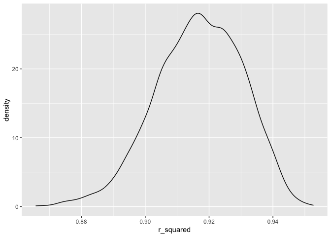

HW 6
================
Nhu Nguyen
2023-12-06

``` r
library(tidyverse)
```

    ## ── Attaching core tidyverse packages ──────────────────────── tidyverse 2.0.0 ──
    ## ✔ dplyr     1.1.3     ✔ readr     2.1.4
    ## ✔ forcats   1.0.0     ✔ stringr   1.5.0
    ## ✔ ggplot2   3.4.3     ✔ tibble    3.2.1
    ## ✔ lubridate 1.9.3     ✔ tidyr     1.3.0
    ## ✔ purrr     1.0.2     
    ## ── Conflicts ────────────────────────────────────────── tidyverse_conflicts() ──
    ## ✖ dplyr::filter() masks stats::filter()
    ## ✖ dplyr::lag()    masks stats::lag()
    ## ℹ Use the conflicted package (<http://conflicted.r-lib.org/>) to force all conflicts to become errors

``` r
library(modelr)
library(mgcv)
```

    ## Loading required package: nlme
    ## 
    ## Attaching package: 'nlme'
    ## 
    ## The following object is masked from 'package:dplyr':
    ## 
    ##     collapse
    ## 
    ## This is mgcv 1.8-41. For overview type 'help("mgcv-package")'.

``` r
library(dplyr)
library(knitr)

set.seed(1)
```

# problem 1

# problem 2

importing data

``` r
weather_df = 
  rnoaa::meteo_pull_monitors(
    c("USW00094728"),
    var = c("PRCP", "TMIN", "TMAX"), 
    date_min = "2022-01-01",
    date_max = "2022-12-31") |>
  mutate(
    name = recode(id, USW00094728 = "CentralPark_NY"),
    tmin = tmin / 10,
    tmax = tmax / 10) |>
  select(name, id, everything())
```

    ## using cached file: /Users/nhunguyen/Library/Caches/org.R-project.R/R/rnoaa/noaa_ghcnd/USW00094728.dly

    ## date created (size, mb): 2023-10-04 20:49:04 (8.527)

    ## file min/max dates: 1869-01-01 / 2023-10-31

creating 5000 bootstrap sample

``` r
bootstrap_df = weather_df |> 
  modelr::bootstrap(n = 5000) |> 
  mutate(
    models = map(strap, \(df) lm(tmax ~ tmin + prcp, data = df)),
    results = map(models, broom::tidy),
    rsq = map(models, broom::glance)) |> 
  select(results, .id, rsq) |> 
  unnest(results) |> 
  filter(term %in% c("tmin", "prcp")) |> 
  group_by(.id) |> 
  mutate(beta1xbeta2 = prod(estimate),
         log_beta_product = log(beta1xbeta2)) |> 
  select(log_beta_product, rsq) |> 
  unnest(rsq) |> 
  janitor::clean_names() |> 
  select(log_beta_product, id, r_squared) |> 
  unique()
```

    ## Warning: There were 3361 warnings in `mutate()`.
    ## The first warning was:
    ## ℹ In argument: `log_beta_product = log(beta1xbeta2)`.
    ## ℹ In group 2: `.id = "0002"`.
    ## Caused by warning in `log()`:
    ## ! NaNs produced
    ## ℹ Run `dplyr::last_dplyr_warnings()` to see the 3360 remaining warnings.

    ## Adding missing grouping variables: `.id`

### plotting distribution of estimates

log of beta product

``` r
bootstrap_df |> 
  ggplot(aes(x = log_beta_product)) + geom_density()
```

    ## Warning: Removed 3361 rows containing non-finite values (`stat_density()`).

<!-- --> This figure
displays the distribution of the estimates of the log of the product of
betas 1 and 2, which is left skewed and unimodal with a peak at around
-5.75.

r-squared

``` r
bootstrap_df |> 
  ggplot(aes(x = r_squared)) + geom_density()
```

<!-- --> This figure
displays the distribution of the estimates of r-squared values, which is
slightly left skewed (although almost normal) and unimodal with a peak
at around 0.916.

95% CI

``` r
bootstrap_conf = bootstrap_df |> 
  unique() |>
  ungroup() |> 
  select(-id) |> 
  summarize(beta_mean = mean(log_beta_product, na.rm = TRUE),
            beta_low = quantile(log_beta_product, 0.025, na.rm = TRUE),
            beta_high = quantile(log_beta_product, 0.975, na.rm = TRUE),
            rs_mean = mean(r_squared),
            rs_low = quantile(r_squared, 0.025),
            rs_high = quantile(r_squared, 0.975))

bootstrap_conf |> knitr::kable()
```

| beta_mean |  beta_low | beta_high |   rs_mean |    rs_low |   rs_high |
|----------:|----------:|----------:|----------:|----------:|----------:|
| -6.089813 | -8.981559 | -4.601673 | 0.9168349 | 0.8885495 | 0.9406812 |

The 95% confidence interval for the log of the beta product is
(-8.9815594, -4.6016727).

The 95% confidence interval for r-squared is (0.8885495, 0.9406812).

# problem 3

importing & cleaning dataset

``` r
bw_df = read.csv("birthweight.csv")

bw_df = bw_df |> 
  janitor::clean_names() |> 
  mutate(
    babysex = as.factor(babysex),
    frace = as.factor(frace),
    malform = as.factor(malform),
    mrace = as.factor(mrace)) |> 
  drop_na()
```

proposed regression model

``` r
fit = lm(bwt ~ gaweeks + smoken + delwt + wtgain, data = bw_df)

fit |>
  broom::tidy() |>
  select(term, estimate, p.value) |>
  knitr::kable(digits=3)
```

| term        | estimate | p.value |
|:------------|---------:|--------:|
| (Intercept) |  -39.244 |   0.671 |
| gaweeks     |   60.852 |   0.000 |
| smoken      |   -7.044 |   0.000 |
| delwt       |    4.605 |   0.000 |
| wtgain      |    5.132 |   0.000 |

``` r
summary(fit)
```

    ## 
    ## Call:
    ## lm(formula = bwt ~ gaweeks + smoken + delwt + wtgain, data = bw_df)
    ## 
    ## Residuals:
    ##      Min       1Q   Median       3Q      Max 
    ## -1758.62  -279.22     4.72   293.17  1505.70 
    ## 
    ## Coefficients:
    ##             Estimate Std. Error t value Pr(>|t|)    
    ## (Intercept) -39.2437    92.3148  -0.425    0.671    
    ## gaweeks      60.8523     2.1695  28.049  < 2e-16 ***
    ## smoken       -7.0436     0.9127  -7.718 1.46e-14 ***
    ## delwt         4.6049     0.3368  13.674  < 2e-16 ***
    ## wtgain        5.1317     0.6851   7.491 8.25e-14 ***
    ## ---
    ## Signif. codes:  0 '***' 0.001 '**' 0.01 '*' 0.05 '.' 0.1 ' ' 1
    ## 
    ## Residual standard error: 444.7 on 4337 degrees of freedom
    ## Multiple R-squared:  0.2468, Adjusted R-squared:  0.2461 
    ## F-statistic: 355.3 on 4 and 4337 DF,  p-value: < 2.2e-16

the proposed regression model is based on biological factors that have
been proven to have an effect on the baby’s weight, including `gaweeks`,
gestational age in weeks, `smoken`, average number of cigarettes smoked
per day during pregnancy, `delwt`, mother’s weight at delivery in
pounds, and `wtgain`, mother’s weight gain during pregnancy in pounds.
as the p0values for the predictors are all less than 0.01, the
hypothesized predictors do not need to be removed from the model.

plotting residuals against fitted values

``` r
bw_df |> 
  modelr::add_residuals(fit) |> 
  modelr::add_predictions(fit) |> 
  ggplot(aes(x = resid, y = pred)) +
  geom_point(alpha = 0.5)
```

<!-- --> the residual
plot displays the majority of residual values being clustered around 0,
with the avg. predicted birth weight hovering around 3250 grams

comparing model to two others

``` r
cv_df =
  crossv_mc(bw_df, 100) |> 
  mutate(
    train = map(train, as_tibble),
    test = map(test, as_tibble))
```

``` r
cv_df = cv_df |> 
  mutate(
    model_prop = map(train, \(df) lm(bwt ~ gaweeks + smoken + delwt + wtgain, data = df)),
    model_1 = map(train, \(df) lm(bwt ~ blength + gaweeks, data = df)),
    model_2 = map(train, \(df) lm(bwt ~ bhead + blength + babysex + bhead*blength + bhead*babysex + blength*babysex + bhead*blength*babysex, data = df))) |> 
  mutate(
    rmse_prop = map2_dbl(model_prop, test, \(mod, df) rmse(model = mod, data = df)),
    rmse_1 = map2_dbl(model_1, test, \(mod, df) rmse(model = mod, data = df)),
    rmse_2 = map2_dbl(model_2, test, \(mod, df) rmse(model = mod, data = df)))

cv_df |> 
  select(starts_with("rmse")) |> 
  pivot_longer(
    everything(),
    names_to = "model",
    values_to = "rmse",
    names_prefix = "rmse_") |> 
  ggplot(aes(x = model, y = rmse)) + geom_violin()
```

<!-- -->

the plot shows the RMSE value distribution for the three different
models. model 2 (comparison model for interaction terms) has the lowest
RMSE values, indicating it has a better predictive performance than the
proposed model and the model with only the main effects. the best fit is
the model with the three-way interaction.
